If you've ever built an event-driven system, you've probably experienced that sinking feeling when you realize messages are getting lost. I certainly have. And that frustration is exactly what led me to create the Mailbox library.

In this post, I'll share the journey of rebuilding Mailbox from XState v4 to v5, but more importantly, I want to help you understand why the Actor Mailbox pattern matters, especially if you're building cloud-native systems with CQRS and Event-Driven Architecture.

By the end, you'll understand:

- Why actors without mailboxes are like restaurants without a queue
- How XState v5 transforms state machines into proper actor brains
- Why Mailbox might be the missing piece in your distributed system architecture

Let's dive in.

## My Story: Why I Built Mailbox

Back in 2021, I was building a conversational AI system. We had dozens of "agents" (think chatbots with personalities) that needed to handle messages from users. Each agent was a state machine: they could be idle, thinking, responding, or waiting for external APIs.

The problem was simple: when multiple users sent messages to the same agent simultaneously, things got messy.

```
User A: "Hello!"        → Agent receives it, starts thinking...
User B: "How are you?"  → Agent is busy... message LOST
User C: "Help me!"      → Agent is still busy... message LOST
```

I was using XState v4 at the time, which is brilliant for modeling state machines. But XState machines process events immediately. If an event arrives while the machine is in a state that doesn't handle it, the event simply disappears.

I searched for solutions. In the Erlang and Elixir world, this is a solved problem because every actor has a mailbox by default. In Akka (Scala and Java), same thing. But in the JavaScript ecosystem, nothing.

So I built Mailbox.

The first version was hacky. It worked, but it fought against XState rather than working with it. When XState v5 was announced with first-class actor support, I knew it was time for a complete rewrite.

This is the story of that rewrite.

## The Problem: Why Actors Need Mailboxes

### The Lost Message Problem

Imagine you're building a coffee shop ordering system. Each coffee machine is an actor: it receives orders, makes coffee, and serves customers.

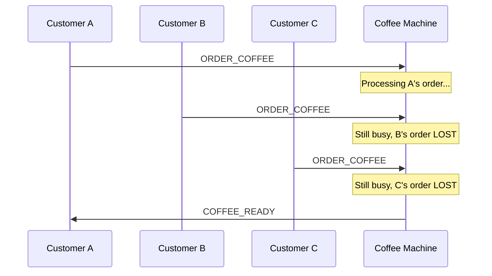

Customers B and C are furious. They paid for coffee they'll never receive. In a real system, this could mean:

- Lost financial transactions
- Corrupted aggregate state
- Angry users or silent data loss

This is the lost message problem, and it happens whenever you have:

1. An actor that processes one thing at a time
2. Multiple senders that don't coordinate
3. No queue to buffer incoming messages

### The Actor Model Refresher

Before we solve this, let's revisit the Actor Model. Proposed by Carl Hewitt in 1973, it's a mathematical model for concurrent computation. Every actor:

1. Processes one message at a time
2. Maintains private state
3. Communicates via messages

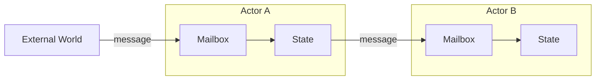

The key insight is that every proper actor implementation includes a mailbox. The mailbox queues incoming messages, and the actor processes them one at a time in order.

Erlang has it. Akka has it. Microsoft Orleans has it.

### JavaScript Reality

JavaScript is single-threaded (mostly), which actually makes it great for actors. No need for locks. But the ecosystem never standardized on an actor framework.

XState came along and gave us beautiful state machines. But XState machines aren't actors in the Hewitt sense because they don't have mailboxes.

When you `send()` an event to an XState machine:

- If the machine can handle it in the current state, it's processed
- If the machine can't handle it, it's silently dropped

This is fine for UI state machines. A button click while a modal is open can be ignored. But for backend message processing, it's a disaster.

### The CQRS Connection

If you're building systems with CQRS (Command Query Responsibility Segregation), this problem is even more critical.

In CQRS, your aggregates receive commands and emit events:

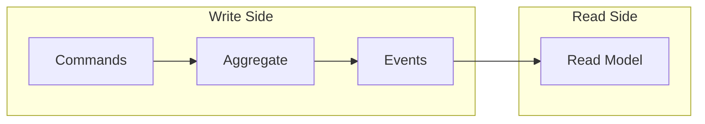

The aggregate must process commands sequentially. Each command might depend on state changes from the previous one:

```
Command 1: CreateOrder(id=123)        → Order created
Command 2: AddItem(id=123, item=A)    → Item added
Command 3: AddItem(id=123, item=B)    → Another item added
Command 4: SubmitOrder(id=123)        → Order submitted
```

If Command 2 arrives before Command 1 is processed, you get invalid state. If Command 4 arrives while Command 2 is processing, you can end up skipping items.

This is where Mailbox shines. It ensures your aggregate (actor) processes commands one at a time, in order, without losing any.

## Enter XState: State Machines as Actor Brains

### Why State Machines for Actors

State machines are a great "brain" for actors because they provide:

1. Explicit states
2. Defined transitions
3. Guards
4. Visual representation

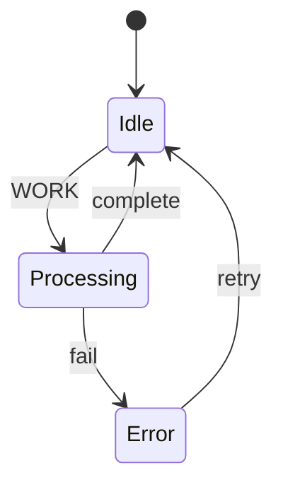

When you combine state machines with mailboxes, you get predictable behavior (state machine guarantees), reliable delivery (mailbox guarantees), and sequential processing (actor model guarantees).

### XState's Evolution: v4 to v5

XState v4 was revolutionary. It brought proper state machines to JavaScript. But actors were bolted on, not built in.

In v4, you'd "spawn" child machines:

```typescript
// XState v4
spawn(childMachine, { name: "child" })
```

XState v5 changed everything. David Khourshid rebuilt XState with the Actor Model at its core:

```typescript
// XState v5
setup({
  actors: {
    child: childMachine,
  },
}).createMachine({
  invoke: {
    id: "child",
    src: "child",
  },
})
```

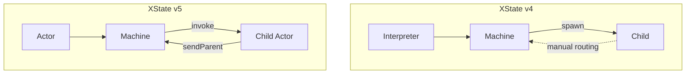

The key improvements in v5:

- `createActor()` instead of `interpret()`
- Native `invoke` for child actors with lifecycle management
- `sendParent()` for parent child communication
- `setup()` API for type-safe machine definitions
- Inspection API for debugging and event capture

These changes aligned perfectly with what Mailbox needed. The rewrite was inevitable.

## The Mailbox Library: Bridging the Gap

### What Mailbox Is

Mailbox is a library that wraps any XState machine and gives it proper actor semantics:

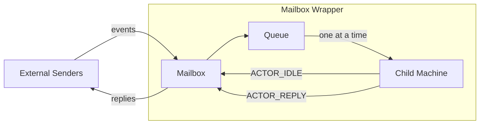

Features:

- Message queuing
- Sequential processing
- Reply routing
- Capacity limits
- Observable interface

### The Mailbox Protocol

The protocol is intentionally simple. Your child machine only needs to do two things.

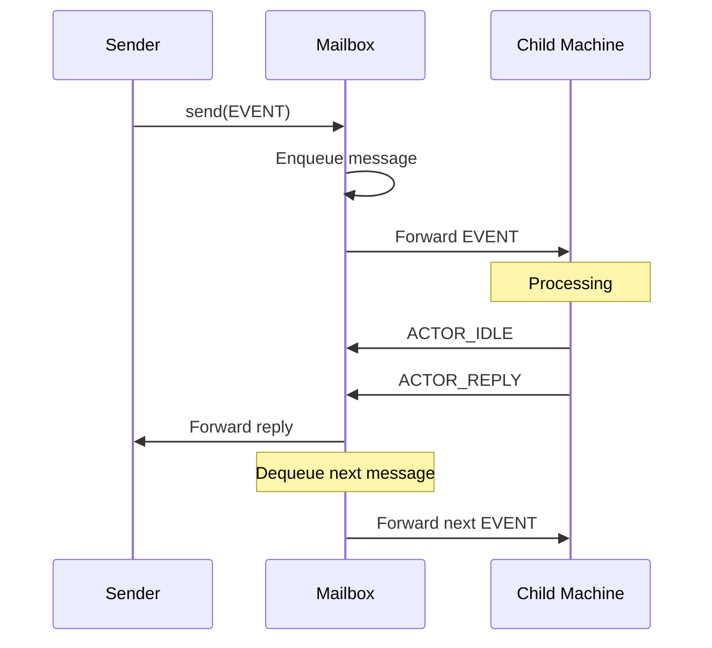

Rule 1: Signal idle.

When your machine is ready for the next message, call `Mailbox.actions.idle()`:

```typescript
idle: {
  entry: Mailbox.actions.idle("worker"),
  on: {
    WORK: "processing",
  },
},
```

Rule 2: Reply when done.

Use `Mailbox.actions.reply()` to send responses:

```typescript
actions: Mailbox.actions.reply(({ context }) => ({
  type: "DONE",
  result: context.result,
})),
```

That's it. Two rules. Your machine doesn't need to know anything about queuing, routing, or mailbox internals.

### Quick Start Example

Here's a complete example: a worker that processes jobs sequentially.

```typescript
import * as Mailbox from "mailbox"
import { setup, assign } from "xstate"

const workerMachine = setup({
  types: {} as {
    context: { result: string | null }
    events:
      | { type: "PROCESS"; data: string }
      | { type: "DONE"; result: string }
  },
}).createMachine({
  id: "worker",
  initial: "idle",
  context: { result: null },
  states: {
    idle: {
      entry: Mailbox.actions.idle("worker"),
      on: {
        PROCESS: "working",
      },
    },
    working: {
      entry: assign({
        result: ({ event }) => `Processed: ${event.data}`,
      }),
      after: {
        100: {
          target: "idle",
          actions: Mailbox.actions.reply(({ context }) => ({
            type: "DONE",
            result: context.result!,
          })),
        },
      },
    },
  },
})

const mailbox = Mailbox.from(workerMachine)

mailbox.subscribe({
  next: (event) => console.log("Reply:", event),
})

mailbox.open()
mailbox.send({ type: "PROCESS", data: "Job 1" })
mailbox.send({ type: "PROCESS", data: "Job 2" })
mailbox.send({ type: "PROCESS", data: "Job 3" })
```

All three jobs are processed sequentially, no messages lost, replies in order.

## The Migration Journey: v4 to v5


### The Old Architecture (v4)

The original Mailbox was complex.

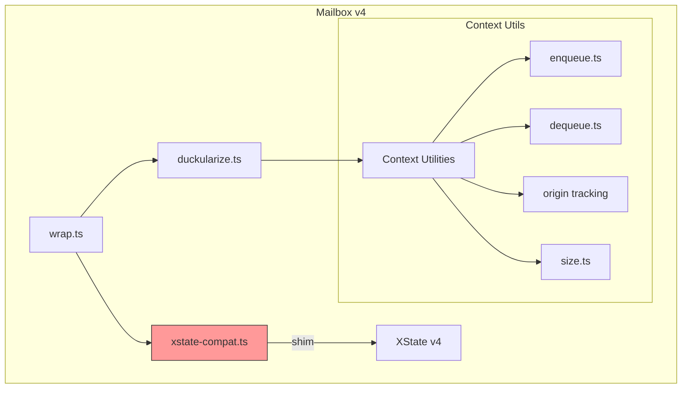

The `xstate-compat.ts` shim was the worst part. XState v4's `spawn()` had quirks that required workarounds.

Total: 50+ files and 7000+ lines of code.

### The New Architecture (v5)

XState v5's native actor support meant we could throw most of that away.

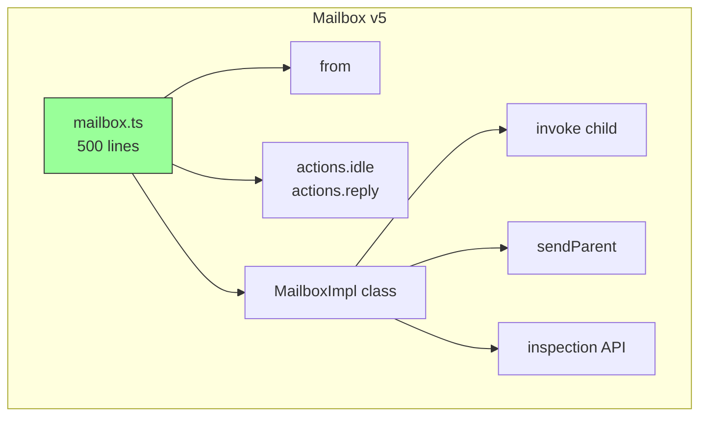

One main file. Around 500 lines. Everything else deleted.

### What Changed Technically

| Aspect | v4 Approach | v5 Approach |
| --- | --- | --- |
| Child actor | `spawn()` + compat shim | Native `invoke` |
| Parent communication | Custom event routing | `sendParent()` |
| Event capture | Manual subscription | Inspection API |
| Type safety | `duckularize()` helper | Native `setup()` |
| Queue management | 6 custom context files | Simple array |
| Lines of code | 7000+ | ~500 |

The v5 approach is cleaner because we're working with XState, not against it.

### The Challenges We Hit

It wasn't all smooth sailing.

1. TypeScript limitations with `enqueueActions`.
2. The `Clock` type no longer exported.
3. Stricter typing in XState v5 patch releases.
4. Cross-platform line endings.

These are the kinds of "migration cuts" you only discover by rebuilding and re-running tests repeatedly.

## My AI Co-Founder

I have a confession: I didn't do this migration alone.

Most of the heavy lifting was done by Claude, my AI co-founder. Here are the stats:

```
134 files changed
3,322 insertions(+)
6,957 deletions(-)
```

How did we work together:

1. I provided the vision.
2. Claude explored the codebase.
3. We iterated on architecture.
4. Claude wrote the code.
5. I reviewed and directed.
6. Claude debugged issues.

The process felt like pair programming with a partner who never gets tired.

## Lessons Learned: Best Practices

### When to Use Mailbox

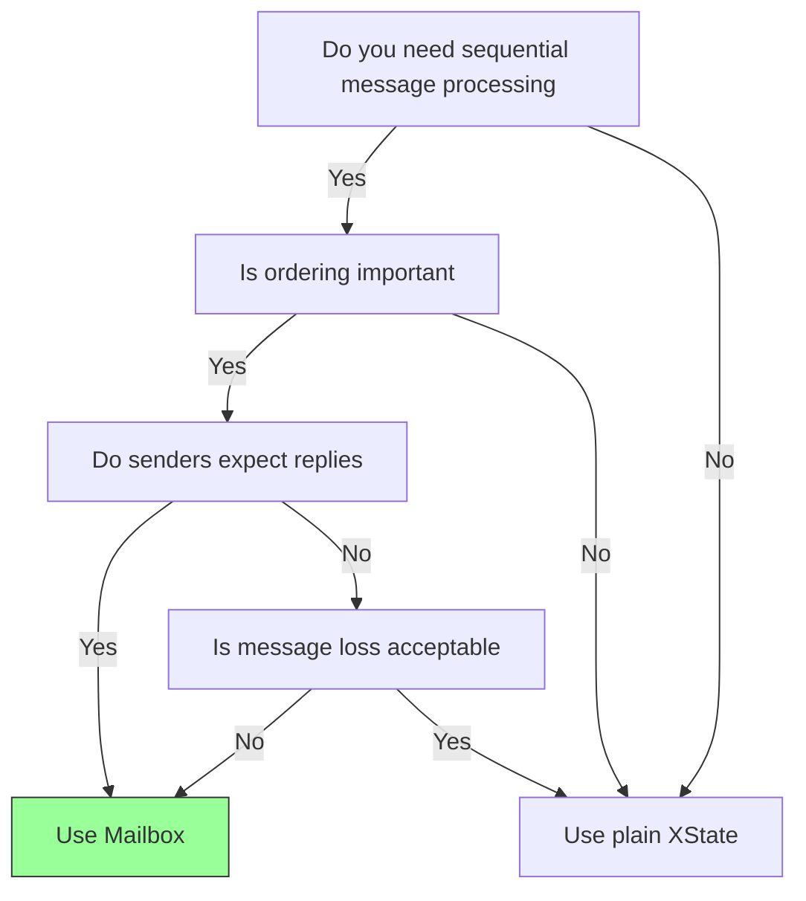

Use Mailbox when:

- Processing commands in CQRS aggregates
- Handling user requests that must be sequential
- Building workflow engines
- Managing resource access (one request at a time)

Use plain XState when:

- UI state management
- Form validation
- Navigation state
- Parallel processing is desired

### Mailbox in CQRS Architecture

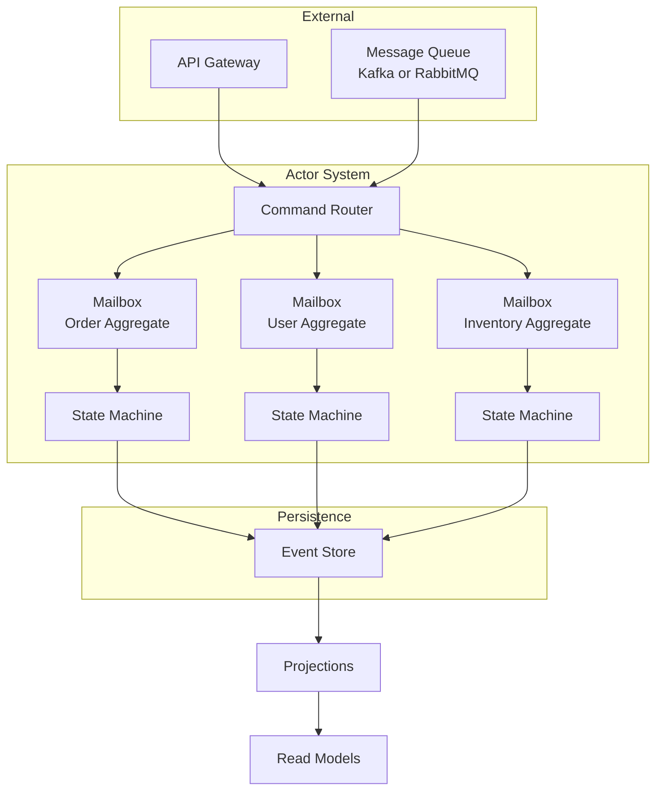

Each aggregate receives commands via its Mailbox, processes them sequentially, emits events to the Event Store, then signals readiness for the next command.

### Design Principles I Learned

1. Keep the protocol simple.
2. Let the state machine do the heavy lifting.
3. Embrace observables.

## Looking Forward

### XState's Trajectory


XState is becoming more than a state machine library.

- Stately.ai
- `@xstate/graph`
- `@statelyai/inspect`

### Mailbox's Future

Ideas I'm exploring:

- Distributed mailboxes
- Persistence
- Cloud queue integration
- Metrics

### The Bigger Picture

The cloud-native, event-driven, CQRS style architecture common in JVM and Erlang worlds is now achievable in Node.js.

## Key Takeaways

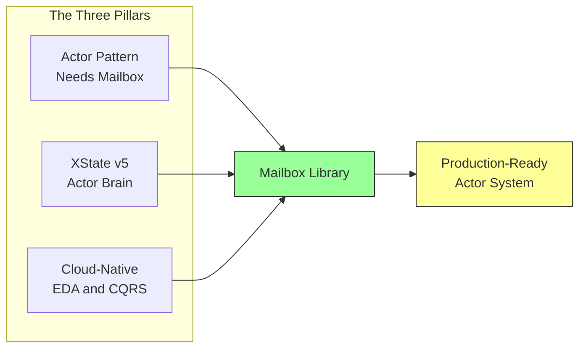

1. Actor pattern needs a mailbox.
2. XState is a great actor brain.
3. Think cloud-native.

## Try It Yourself

```bash
npm install mailbox xstate
```

```typescript
import * as Mailbox from "mailbox"
import { setup } from "xstate"

const myMachine = setup({
  // your machine definition
}).createMachine({
  // ...
  states: {
    idle: {
      entry: Mailbox.actions.idle("my-actor"),
      // ...
    },
  },
})

const mailbox = Mailbox.from(myMachine)
mailbox.open()
mailbox.send({ type: "YOUR_EVENT" })
```

Check out the GitHub repository at <https://github.com/huan/mailbox> for more examples.

## Final Thoughts

Building Mailbox has been a journey. From hacky v4 workarounds to clean v5 native code, the library evolved alongside XState itself.

But the core insight remains the same: actors need mailboxes.

If you're building event-driven systems in TypeScript, I hope Mailbox helps you avoid the lost message pain I experienced.

Happy coding, and may your messages never be lost.

— Huan LI

Have questions or feedback. Open an issue at <https://github.com/huan/mailbox/issues> or find me on Twitter at <https://twitter.com/huan2027>.

Pull Request at <https://github.com/huan/mailbox/pull/12>

This post was written with significant assistance from Claude (Anthropic), my AI co-founder for this refactoring project. The future of open source is collaborative: humans and AI working together.
